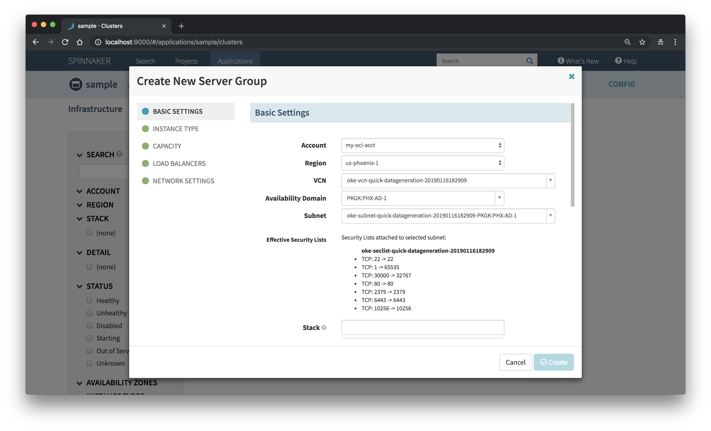
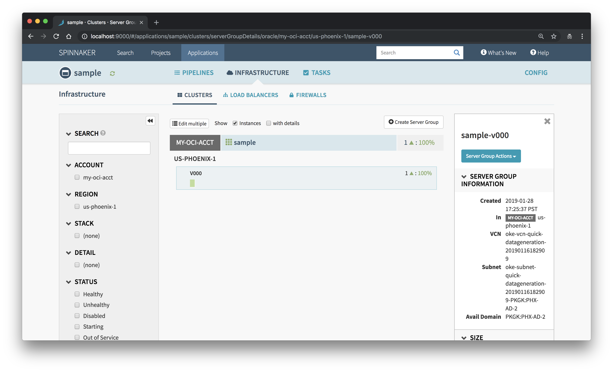
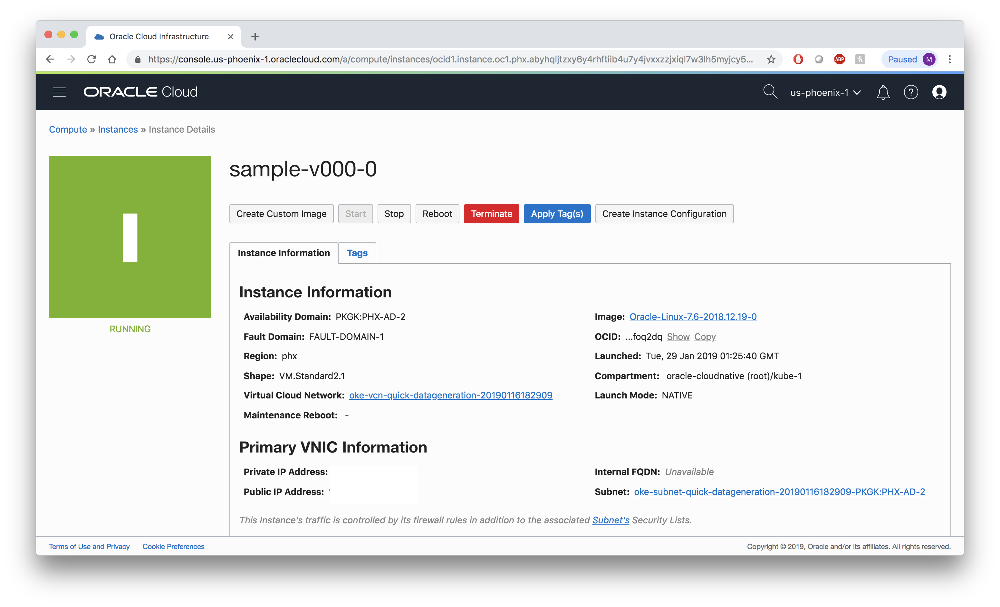

# Spinnaker: Oracle Provider Local Debian Installation 

## Overview

Spinnaker is an open source continuous delivery platform that enables you to rapidly and reliably release software changes. It can be used to create deployment pipelines to create and destroy server groups, run systems and integration tests, and monitor rollouts. These pipelines can be triggered via numerous sources, including git events, Jenkins, etc. Another benefit of Spinnaker is that it can be used to deploy across multiple cloud vendors through the use of providers. 

This guide will walk through the process of installing and configuring Spinnaker for use with Oracle Cloud Infrastructure (OCI). After the installation we will perform a provider-based deployment of a Hello World pod and service. Additional information about the OCI Cloud Provider for Spinnaker is available [here](https://www.spinnaker.io/reference/providers/oracle/). 

### Prerequisites

In Spinnaker, a **provider** is an integration to the cloud platform on which you deploy applications. To use a provider you need to register credentials, known as **accounts**.

The Oracle Cloud provider supports both instance-based and Kubernetes-based deployments. The instance-based approach enables the creation of OCI Images, Instances, and Load Balancers. The Kubernetes-based approach supports the standard operations available to Oracle Container Engine for Kubernetes (OKE). In order to push to OKE you will need access to an OKE cluster. For more information about creating an OKE cluster follow this [guide](http://www.oracle.com/webfolder/technetwork/tutorials/obe/oci/oke-full/index.html). Additionally, Spinnaker relies on `kubectl` to manage all API access. Ensure that the config file kubectl defaults to is the one you want to use. The current installer requires your `kubectl` to be version 1.10 or greater and installed on the same machine running Halyard.  

[Oracle Object Storage](https://docs.cloud.oracle.com/iaas/Content/Object/Concepts/objectstorageoverview.htm) is available to be used as a storage provider for the persitent store and as an artifact repository. Oracle [Registry](https://docs.cloud.oracle.com/iaas/Content/Registry/Concepts/registryoverview.htm) is available as a Docker image registry.

### Installation

Start by downloading Halyard, the tool used to manage the lifecycle of your Spinnaker deployment: `curl -O https://raw.githubusercontent.com/spinnaker/halyard/master/install/debian/InstallHalyard.sh`

Install it with: `sudo bash InstallHalyard.sh`

This requires Java 8 which can be installed with `sudo bash InstallHalyard.sh` 

This should install the `hal` command in `/usr/local/bin`. You can test that you have the correct version in your path by running `hal -v`. `hal` will bring up a list of helpful commands. 

You will need the following information to enable the Oracle Cloud provider in Spinnaker:

- `--compartment-id`: Compartment OCID (e.g. `--compartment-id ocid1.compartment.oc1..aa...`). For more information go to [Managing Compartments](https://docs.cloud.oracle.com/iaas/Content/Identity/Tasks/managingcompartments.htm). 

- `--fingerprint` Fingerprint of the public key (e.g. `--fingerprint 11:22:33:..:aa`). For more information go to [How to Get the Key’s Fingerprint](https://docs.cloud.oracle.com/iaas/Content/API/Concepts/apisigningkey.htm#How3). 

- ` --namespace`: Your Tenancy name (e.g. `--namespace my-tenancy`). 

- `--region`: The user’s home region (e.g. `--region us-ashburn-1`). For more information go to [Managing Regions](https://docs.cloud.oracle.com/iaas/Content/Identity/Tasks/managingregions.htm). 

- `--ssh-private-key-file-path`: RSA key pair in PEM format (minimum 2048 bits) (e.g. `--ssh-private-key-file-path /home/ubuntu/.oci/myPrivateKey.pem`). For more information go to [How to Generate an API Signing Key](https://docs.cloud.oracle.com/iaas/Content/API/Concepts/apisigningkey.htm#How). The PEM key has to be created without a password in order to work. Spinnaker 1.11.x. will provide support for the additional parameter --private-key-passphrase. Upload the public key from the key pair in the Console. For more information go to [How to Upload the Public Key](https://docs.cloud.oracle.com/iaas/Content/API/Concepts/apisigningkey.htm#How2). In spite of what the name implies, use the path to your private .pem key instead of your private .ssh key.

- ` --tenancy-id`: Tenancy OCID (e.g. `--tenancyId ocid1.tenancy.oc1..aa...`). For more information go to [Where to Get the Tenancy’s OCID and User’s OCID](https://docs.cloud.oracle.com/iaas/Content/API/Concepts/apisigningkey.htm#Other).

- `--user-id`: User OCID (e.g. `--user-id ocid1.user.oc1..aa...`). For more information go to [Where to Get the Tenancy’s OCID and User’s OCID](https://docs.cloud.oracle.com/iaas/Content/API/Concepts/apisigningkey.htm#Other). The user will need to have permissions for Object Storage in the OCI Identity and Access Management system. For more information go to [Adding Users](https://docs.cloud.oracle.com/iaas/Content/GSG/Tasks/addingusers.htm) and [Object Storage Policy](https://docs.cloud.oracle.com/iaas/Content/Identity/Reference/objectstoragepolicyreference.htm).


Add an account called `my-oci-acct` to your list of Oracle Cloud accounts: 

```
hal config provider oracle account add my-oci-acct \
    --compartment-id $COMPARTMENT_OCID \
    --fingerprint $API_KEY_FINGERPRINT \
    --region $REGION \
    --ssh-private-key-file-path $PRIVATE_KEY_FILE \
    --tenancyId $TENANCY_OCID \
    --user-id $USER_OCID
```

Enable the Oracle Cloud provider with: `hal config provider oracle enable`

Output: 

```
$ hal config provider oracle enable
+ Get current deployment
  Success
WARNING: An illegal reflective access operation has occurred
WARNING: Illegal reflective access by com.fasterxml.jackson.databind.util.ClassUtil (file:/opt/halyard/lib/jackson-databind-2.9.6.jar) to constructor java.lang.Void()
WARNING: Please consider reporting this to the maintainers of com.fasterxml.jackson.databind.util.ClassUtil
WARNING: Use --illegal-access=warn to enable warnings of further illegal reflective access operations
WARNING: All illegal access operations will be denied in a future release
+ Edit the oracle provider
  Success
+ Successfully enabled oracle
```
You may see certain warnings pop up in output of your commands. These will not impact the successful deployment of Spinnaker and since Spinnaker is in continuous development they should no longer appear in more recent versions.

Choose `localdebian` as the environment on which Halyard will install Spinnaker. This installation option means that Spinnaker will be downloaded and run on the machine Halyard is installed onto. Given that all Spinnaker services are running on a single machine, there will be downtime when Halyard updates Spinnaker. Halyard defaults to a Local Debian install when first run. If you have changed the deploy option, you will need to run `hal config deploy edit --type localdebian` to revert to a local install. 

Output: 

```
$ hal config deploy edit --type localdebian
+ Get current deployment
  Success
+ Get the deployment environment
  Success
WARNING: An illegal reflective access operation has occurred
WARNING: Illegal reflective access by com.fasterxml.jackson.databind.util.ClassUtil (file:/opt/halyard/lib/jackson-databind-2.9.6.jar) to constructor java.lang.Void()
WARNING: Please consider reporting this to the maintainers of com.fasterxml.jackson.databind.util.ClassUtil
WARNING: Use --illegal-access=warn to enable warnings of further illegal reflective access operations
WARNING: All illegal access operations will be denied in a future release
+ Edit the deployment environment
  Success
+ Successfully updated your deployment environment.
```


The next step is to provide Spinnaker with a Persistent Storage source. In this case we will be connecting to Oracle Cloud Infrastructure Object Storage. 

You will need the following information to enable Oracle Object Storage in Spinnaker:

- `--bucket-name`: A bucket to store persistent data within the Object Storage namespace. If you do not already have a bucket that you want to use, Halyard will create one for you (either with the `--bucket-name` value provided, or `_spinnaker_front50_data` by default). See [Managing Buckets](https://docs.cloud.oracle.com/iaas/Content/Object/Tasks/managingbuckets.htm). (e.g. `--bucket-name my-spinnaker-bucket`)

Fill out the Oracle Cloud Infrastructure Object Storage source with your OCI credentials: 

```
$ hal config storage oracle edit \
    --bucket-name $BUCKET_NAME \
    --compartment-id $COMPARTMENT_OCID \
    --fingerprint $API_KEY_FINGERPRINT \
    --namespace $TENANCY_NAME \
    --region $REGION \
    --ssh-private-key-file-path  $PRIVATE_KEY_FILE \
    --tenancy-id $TENANCY_OCID \
    --user-id $USER_OCID 
```

Output: 

```
$ hal config storage oracle edit \
>     --bucket-name spinnaker \
>     --compartment-id ocid1.compartment.oc1..aaaaaaaa6xkpezjs764l2bhm7dxmd2cliykmuomd26tuwttbl7xifuliywqq \
>     --fingerprint 8f:05:f4:94:f3:5f:e3:30:ec:35:8e:77:3e:40:34:10 \
>     --namespace oracle-cloudnative \
>     --region us-phoenix-1 \
>     --ssh-private-key-file-path ~/.oci/oci_api_key.pem \
>     --tenancy-id ocid1.tenancy.oc1..aaaaaaaa225wmphohi3iiyxxxjruojirfhbn6ewhd7jgskabtdve3d2qmq4a \
>     --user-id ocid1.user.oc1..aaaaaaaagosdr3zsh67tvgpnmw42ywqc74yobsvjmik7tu53clobgeqqawsq
+ Get current deployment
  Success
+ Get persistent store
  Success
WARNING: An illegal reflective access operation has occurred
WARNING: Illegal reflective access by com.fasterxml.jackson.databind.util.ClassUtil (file:/opt/halyard/lib/jackson-databind-2.9.6.jar) to constructor java.lang.Void()
WARNING: Please consider reporting this to the maintainers of com.fasterxml.jackson.databind.util.ClassUtil
WARNING: Use --illegal-access=warn to enable warnings of further illegal reflective access operations
WARNING: All illegal access operations will be denied in a future release
+ Edit persistent store
  Success
+ Successfully edited persistent store "oracle".
```

Set the storage source to Oracle Object Storage: `hal config storage edit --type oracle`

Output: 

```
+ Get current deployment
  Success
+ Get persistent storage settings
  Success
WARNING: An illegal reflective access operation has occurred
WARNING: Illegal reflective access by com.fasterxml.jackson.databind.util.ClassUtil (file:/opt/halyard/lib/jackson-databind-2.8.8.jar) to constructor java.lang.Void()
WARNING: Please consider reporting this to the maintainers of com.fasterxml.jackson.databind.util.ClassUtil
WARNING: Use --illegal-access=warn to enable warnings of further illegal reflective access operations
WARNING: All illegal access operations will be denied in a future release
+ Edit persistent storage settings
  Success
+ Successfully edited persistent storage.
```

List the versions of Spinnaker available for deployment: `hal version list`

Output:

```
$ hal version list
+ Get current deployment
  Success
+ Get Spinnaker version
  Success
+ Get released versions
  Success
+ You are on version "1.11.3", and the following are available:
 - 1.9.5 (Bright):
   Changelog: https://gist.github.com/spinnaker-release/d24a2c737db49dda644169cf5fe6d56e
   Published: Mon Oct 01 10:15:37 PDT 2018
   (Requires Halyard >= 1.0.0)
 - 1.10.11 (Maniac):
   Changelog: https://gist.github.com/spinnaker-release/8c6e6abe2a0016b823b900523e82cba1
   Published: Tue Jan 15 05:41:25 PST 2019
   (Requires Halyard >= 1.11)
 - 1.11.6 (Cobra Kai):
   Changelog: https://gist.github.com/spinnaker-release/5cbb402297feb85f82482a73e9428967
   Published: Tue Jan 15 04:29:34 PST 2019
   (Requires Halyard >= 1.11)
```

Select the version you would like to deploy: `hal config version edit --version 1.11.8`

Output: 

```
$ hal config version edit --version 1.11.6
+ Get current deployment
  Success
WARNING: An illegal reflective access operation has occurred
WARNING: Illegal reflective access by com.fasterxml.jackson.databind.util.ClassUtil (file:/opt/halyard/lib/jackson-databind-2.9.6.jar) to constructor java.lang.Void()
WARNING: Please consider reporting this to the maintainers of com.fasterxml.jackson.databind.util.ClassUtil
WARNING: Use --illegal-access=warn to enable warnings of further illegal reflective access operations
WARNING: All illegal access operations will be denied in a future release
+ Edit Spinnaker version
  Success
+ Spinnaker has been configured to update/install version "1.11.6".
  Deploy this version of Spinnaker with `hal deploy apply`
```

 

Deploy Spinnaker: `sudo hal deploy apply`

Output: 

```
$ hal deploy apply
+ Get current deployment
  Success
+ Prep deployment
  Success
Problems in default.security:
- WARNING Your UI or API domain does not have override base URLs
  set even though your Spinnaker deployment is a Distributed deployment on a
  remote cloud provider. As a result, you will need to open SSH tunnels against
  that deployment to access Spinnaker.
? We recommend that you instead configure an authentication
  mechanism (OAuth2, SAML2, or x509) to make it easier to access Spinnaker
  securely, and then register the intended Domain and IP addresses that your
  publicly facing services will be using.

Problems in default.provider.dockerRegistry.my-docker-registry:
- WARNING You have a supplied a username but no password.

- WARNING Your docker registry has no repositories specified, and
  the registry's catalog is empty. Spinnaker will not be able to deploy any images
  until some are pushed to this registry.
? Manually specify some repositories for this docker registry to
  index.

+ Preparation complete... deploying Spinnaker
+ Get current deployment
  Success
+ Preparation complete... deploying Spinnaker
+ Get current deployment
  Success
+ Apply deployment
  Success
+ Run `hal deploy connect` to connect to Spinnaker.
```

Restart the dameon with `sudo systemctl daemon-reload`

By default, the Spinnaker UI runs on port 9000. You can use an SSH tunnel to access this from your local machine. `ssh -A -L 9000:localhost:9000 -L 8084:localhost:8084 ubuntu@IP`

Navigate to Spinnaker Deck running on http://localhost:9000. 

Let’s get familiar with Spinnaker concepts and terminology by deploying a sample application. Click "Actions" and then "Create Application". Enter a name for your application and a contact email address and then click "Create". 


On the next page click "Create Server Group" and make sure to choose "my-oci-acct", the OCI Cloud Provider configured for Spinnaker, from the "Account" pull down menu. A "Server Group" is a collection of servers. Clicking "Create" will provision a virtual machine or group of virtual machines. 



You will receive a confirmation when your server group has been successfully created. Clicking on your cluster will provide additional information about the server group. 



You can use the OCI conole to verify the server creation. 



### Clean Up 

To delete everything created during this walkthrough, you can select the server group in the Spinnaker UI and click “Destroy” from the dropdown menu. This will delete the virtual machines and block storage created by Spinnaker. Another option is to manually delete everything by means of the OCI console.  

Run `hal deploy clean` to purge the deployment of Spinnaker created using Halyard. 

Uninstall Halyard with: `sudo ~/.hal/uninstall.sh`