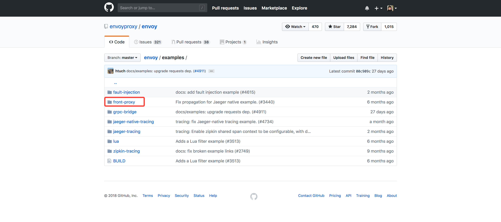
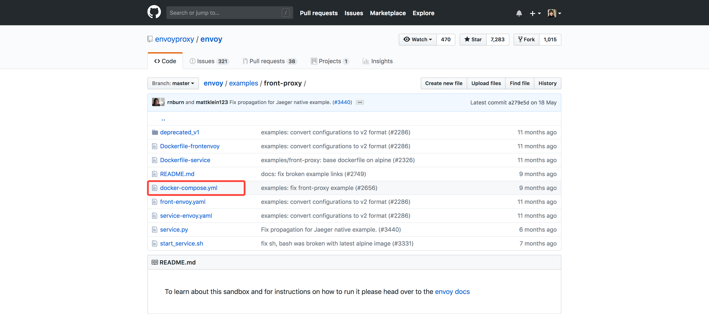
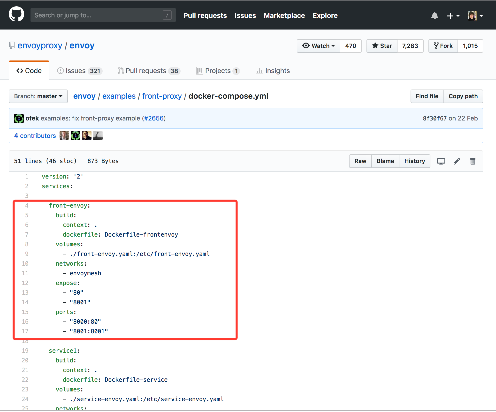
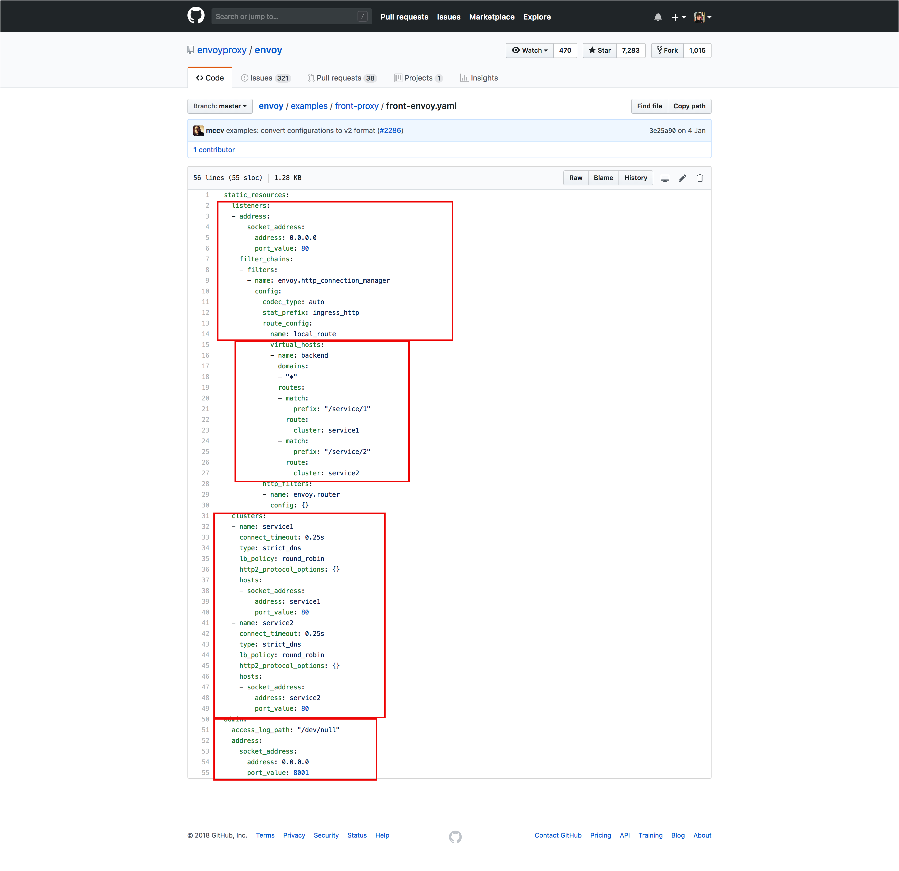

## Getting Started with Envoy

<<<<<<< HEAD
Before running Envoy in a production setting we're going to take it for a test drive on our laptops. By the end of this tutorial you’ll quickly get the idea behind using Envoy to proxy traffic, and learn what place it might have in your network architecture. We’ll walk through how to run Envoy, the various configurations available and how to change them. To do this we're going to use Docker and Docker Compose.
=======
Before running Envoy in a production setting we're going to take it for a test drive on our laptops. By the end of this tutorial you’ll quickly get the idea behind using Envoy to proxy traffic, and learn what place it might have in your network architecture. We’ll walk through how to run Envoy, the various configurations and how to change them. To do this we're going to use Docker and Docker Compose.
>>>>>>> Prerequisites-fix

### Step 1 - Setting Up

Mosey over to the [Envoy GitHub repository](https://github.com/envoyproxy/envoy) and copy the URL. Then in your terminal type: 

```$ Git clone https://github.com/envoyproxy/envoy.git```

 
 
 
 
Now that we have the repo locally, let's take a moment to browse the files and get aquainted. Type:

```$ cd envoy/examples/front-proxy```and then ```ls```


What we have in here is a simple Flask application, defined in service.py. Envoy runs in the same container as a sidecar, configured with the service-envoy.yaml file. Finally, the Dockerfile-service creates a container that runs Envoy and the service on startup.

The front proxy runs Envoy, configured with the front-envoy.yaml file, and uses `Dockerfile-frontenvoy` as its container definition.

The `docker-compose.yaml` file provides a description of how to build, package, and run the front proxy and services together.
 
### Step 2 - Build a Container

Let's start an instance of the front proxy. 

```$ docker-compose up --build -d```


This starts a single instance of the front proxy and two service instances, one configured as “service1” and the other as “service2”. 

Let's have a look at them; type: 

```$ docker-compose ps```


### Step 3 - Send Traffic

Let's connect to service one and then two by typing: 

```$ curl localhost:8000/service/1```

You should get the following output: 


Now let's try the second one:

```$ curl localhost:8000/service/2```

You should get the following output: 


That should give you a tiny taste. Let's move on to configuration. 

### Step 4 - Configuration

Let’s take a look at how Envoy is configured. Have a look inside the `docker-compose.yaml` and the `front-envoy.yaml` and unpack them. Both can be found in `front-proxy`




First things first, let's have a look in the `docker-compose.yaml`





What you see described above is: 

* Build a container using the `Dockerfile-frontenvoy` 
* Mount the `front-envoy.yaml` file in this directory as `/etc/front-envoy.yaml`
* Create and use a Docker network named "envoymesh" for this container
* Expose port 80 to general traffic
* Expose port 8001 to the admin server
* Map the host port 8000 to container port 80, and the host port 8001 to container port 8001

Let's have a look at the `front-envoy.yaml`




The file has two top level elements, Static_Resources and Admin:

### Static_Resources

The `static_resources` block contains definitions for listeners, virtual hosts and clusters. 

* **Listeners** - we have one here, but Envoy configuration can support any number of listeners. Each listener is independently configured with some number of network level (L3/L4) filters. The generic listener architecture is used to perform the vast majority of different proxy tasks that Envoy is used for (e.g., rate limiting, TLS client authentication, HTTP connection management, raw TCP proxy, etc.).

* **Virtual hosts** - there is a definition for a single virtual host, configured to accept traffic for all domains. Each virtual host has a logical name as well as a set of domains that get routed to it based on the incoming request's host header. This allows a single listener to service multiple top level domain path trees.

* **Clusters** - Envoy’s cluster manager manages all configured upstream clusters. Just as the Envoy configuration can contain any number of listeners, the configuration can also contain any number of independently configured upstream clusters. You can configure timeouts, circuit breakers, discovery settings, and more on clusters.


### Admin

In the Envoy configuration file you can see an `admin:` section, which configures Envoy's admin endpoint. That can be used for checking various diagnostic information about the proxy.


### Step 5 - Clean Up

Throughout this tutorial, you'll have created some stray containers that will eat up disk space. To remove unwanted containers type `docker rm` and the container IDs from the containers you want to get rid of. If you have no idea what the id's are just type `docker ps` and paste them alongside the command `docker rm`

If you have a bunch of containers to delete in one go, copy-pasting IDs can be tedious. In that case, you can simply type:

`docker system prune`

To additionally remove any stopped containers and all unused images (not just dangling images), add the `-a` flag to the command:

`$ docker system prune -a`

This puts up this warning. In our case press 'y'


That's it! Hope you have enjoyed dipping your feet in the water.


 
 

 
 
 


 

