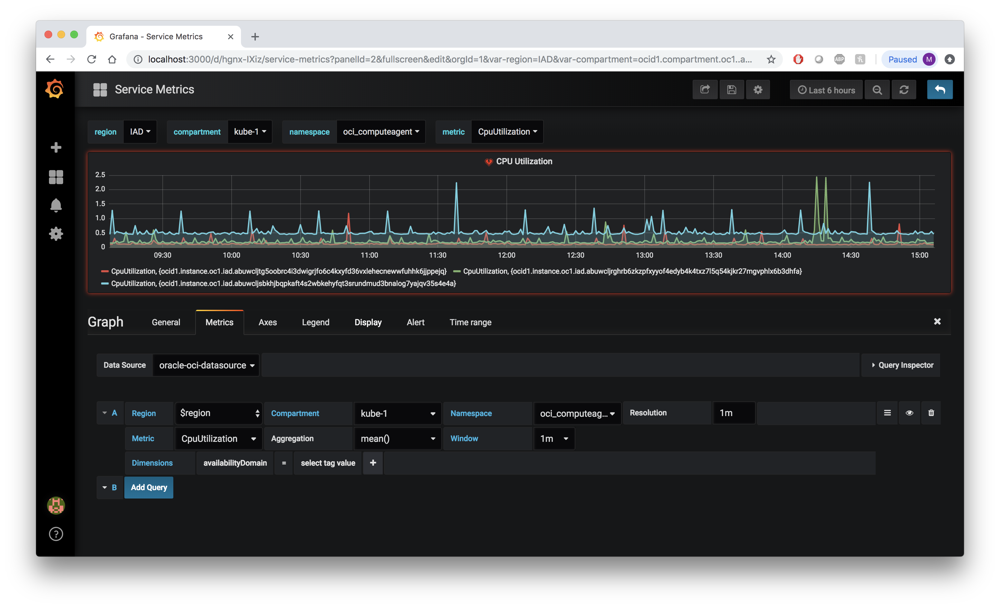
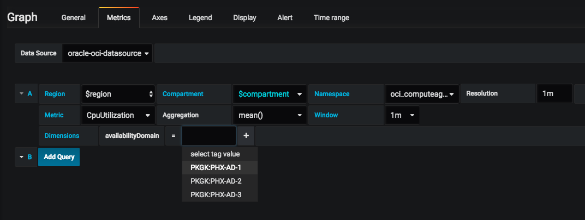

# Using Grafana with the Oracle Cloud Infrastructure Data Source 

Here are a few tools for you to explore after installing and configuring the Oracle Cloud Infrastructure Data Source for Grafana. 

## Query Editor

The query editor can be used to create graphs of your Oracle Cloud Infrastructure resources.

On the Grafana Home Dashboard and click **New Dashboard**.

Choose **Graph** from the list of available dashboard types.

Click **Panel Title** and then **Edit** to add metrics to the dashboard.

Choose the appropriate **Region**, **Compartment**, **Namespace**, **Metric**, and **Dimension** from the list of available options.

Click the save icon to save your graph.

At this stage, if the **metrics** pull down menu is not properly populating with options, you may need to navigate back to the OCI console add an additional matching rule to your Dynamic Group stating: `matching_rule = “ANY {instance.compartment.id = ‘${var.compartment_ocid}’}”`. After doing so, restart the Grafana server as the **sudo** user run `systemctl restart grafana-server` and reload the Grafana console. 

## Templating 

Templating provides the ability to dynamically switch the contents of graphs as seen in the example below. 

In order to configure templating, click on the gear icon in the upper right corner of the dashboard creation page from the previous step. This will take you to the **Settings** page. Click the **Variables** tab and then click the **Add variable** button. 

Add the **region** variable to this page. Give the variable the name `region`, choose **OCI** from the list of data sources, and for **Query** enter `regions()`. 

The page will load a preview of valuables available for that variable. Scroll down and click **Add** to create a template variable for regions. 

Repeat the process for the following OCI variables: 

| Name        | Query                              |
| ----------- | ---------------------------------- |
| region      | `regions()`                        |
| compartment | `compartments()`                   |
| namespace   | `namespaces()`                     |
| metric      | `metrics($namespace,$compartment)` |

The final list of variables should look like this: 

In order for these variables be available to be dynamically changed in your query, edit your existing query, and under **metrics** select the newly created variables for **region**, **compartment**, **namespace**, and **metric** as seen in the image below. 

Choose the save icon to save your dashboard. 

### Dimensions

Dimensions can be used to add specificity to your graphs. To use dimensions create a new graph or navigate to an existing one and click the **Metrics** tab. After selecting your variables click the **+** next to **Dimensions** and select one of the tag filters from the list. For example, select `availabilityDomain` from the list. Next, click **select tag value** and choose from the newly populated list of tag values. If you chose `availabilityDomain` as your tag filter, you should see tag values corresponding to the availability domains in which you currently have services provisioned, for example `US-ASHBURN-AD-1`. 

## Custom Metrics and Namespaces

Oracle Cloud Infrastructure allows for the creation of custom metrics namespaces, which can be used to ingest data from sources in addition to the native Oracle Cloud Infrastructure resources available by default. For example, an application could be instrumented to gather statistics about individual operations. The resource posting custom metrics must be able to authenticate to Oracle Cloud Infrastructure using either using the Oracle Cloud Infrastructure CLI authentication mentioned above or using [instance principals](https://docs.cloud.oracle.com/iaas/Content/Identity/Tasks/callingservicesfrominstances.htm). In the example below you can see the option to select `custom_namespace` from the **Namespace** drop down. 

You can also see two custom metrics `CustomMetric` and `CustomMetric2` from the **Metric** dropdown. 

